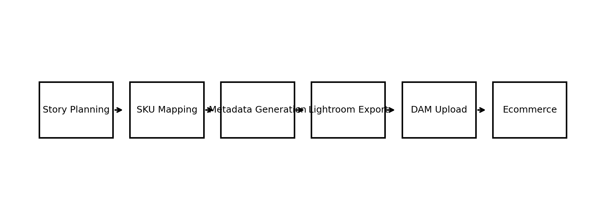

# Asset Pipeline Automation Framework (Portfolio Edition)

**Version:** 1.0.0-public  
**Last Updated:** 2026-02-19

This is a portfolio-safe, public demonstration of a metadata-driven asset pipeline system.

The framework models how a creative production team can:
- Standardize intake and shot planning
- Automate metadata generation
- Eliminate manual entry during asset processing
- Improve downstream searchability and consistency

⚠️ This repository contains **sanitized templates and placeholder data only.**
No proprietary company information is included.

---
## System Architecture

  

The framework follows a metadata-first workflow:

Story Planning  
→ SKU Mapping  
→ Metadata Generation  
→ Lightroom Export  
→ DAM Upload  
→ Ecommerce

## Core Principles

- Metadata-first architecture
- Schema governance
- Version control discipline
- Elimination of manual keyword entry
- Production consistency at scale

## Why It Matters

Manual asset workflows introduce:
- Naming inconsistencies
- Metadata gaps
- Search inefficiencies
- Rework loops

This system replaces ad-hoc production with structured automation.
📘 See full workflow breakdown → [Workflow Overview](docs/OVERVIEW.md)

📘 Full workflow breakdown → [Overview](docs/OVERVIEW.md)

## System Overview

The framework is built around a metadata-first architecture:

1. Stories (content batches) are defined
2. SKUs are mapped to required shots
3. Metadata outputs are auto-generated:
   - Filename prefix
   - Title
   - Description
   - Keywords
4. Outputs feed into Lightroom → DAM → Ecommerce

---

## Repository Structure

- `docs/` — System architecture & workflow documentation
- `schema/` — Public schema model
- `data/` — Example allowed values (generic)
- `scripts/` — Sample metadata generation logic
- `templates/` — CSV templates (headers only)

---

## Purpose

This repository demonstrates:
- Systems thinking
- Workflow automation
- Metadata architecture design
- Creative pipeline optimization
- Governance & version discipline

---
## Case Study

This repository is part of a broader creative infrastructure initiative focused on:

- Reducing manual metadata entry
- Improving DAM searchability
- Standardizing production naming conventions
- Introducing version-controlled workflow governance

📎 Full case study available in portfolio:
[View Detailed Case Study →](https://yourportfolio.com)

## License

MIT

## Architecture (High Level)

